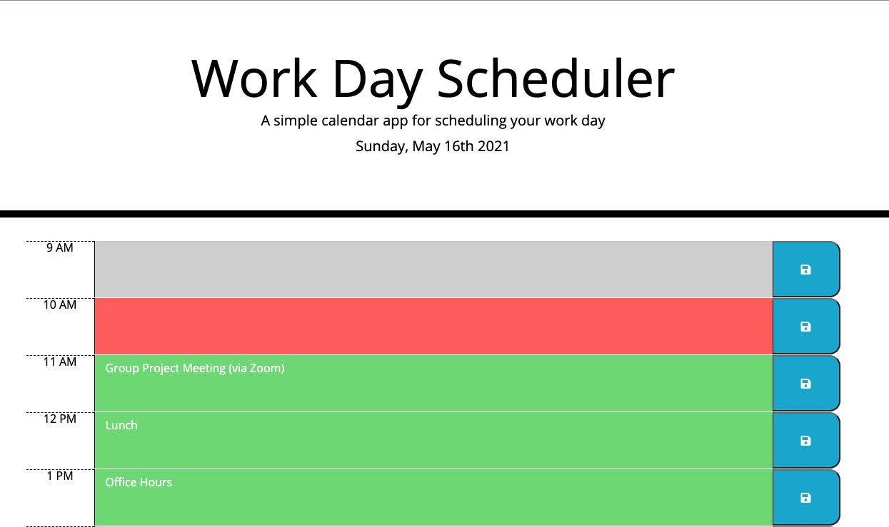

# challenge-5-work-scheduler-third-party-apis
## Description
This project was developed and designed to be a work day scheduler. This work day shows from 9 am to 5 pm.  The date is shown at the top of the page and changes at the start of each new day. This scheduler is broken down hour by hour. The user can input information in the text area for each hour. There is a save button that will save the user input to local storage and pull the information if the page is refreshed or closed and opened back up. The scheduler will highlight each hour of the day based on the current time. For example, if the current time is 11 am. The 9 am and 10 am time slots will be gray, while 12 pm-5 pm will be highlighted green. The current time slot, in this example, 11 am, would be highlighted red. 

## Built With 
* HTML
* CSS
* JavaScript
* JQuery
* Moment.js
* Bootstrap

## Acceptance Criteria

```
GIVEN I am using a daily planner to create a schedule
WHEN I open the planner
THEN the current day is displayed at the top of the calendar
WHEN I scroll down
THEN I am presented with timeblocks for standard business hours
WHEN I view the timeblocks for that day
THEN each timeblock is color coded to indicate whether it is in the past, present, or future
WHEN I click into a timeblock
THEN I can enter an event
WHEN I click the save button for that timeblock
THEN the text for that event is saved in local storage
WHEN I refresh the page
THEN the saved events persist
```
## Website
[Work Day Scheduler](https://jerismith32.github.io/challenge-5-work-scheduler-third-party-apis/)

## Website Screenshots



## Contributions
Contributions made by Jeri Smith

## References
[Moment.js](https://momentjs.com/)


[Formatting Moment](https://devhints.io/moment)


[Bootstrap Horizontal Alignment](https://mdbootstrap.com/docs/b4/jquery/utilities/horizontal-align/)


[jQuery .each()](https://api.jquery.com/each/)


[jQuery .addClass()](https://api.jquery.com/addclass/)


[parseInt()](https://developer.mozilla.org/en-US/docs/Web/JavaScript/Reference/Global_Objects/parseInt)


[Save Icon](https://fontawesome.com/icons/save)


[W3 Schools Local Storage](https://www.w3schools.com/jsref/prop_win_localstorage.asp)


- - -
© 2021 Trilogy Education Services, LLC, a 2U, Inc. brand. Confidential and Proprietary. All Rights Reserved.